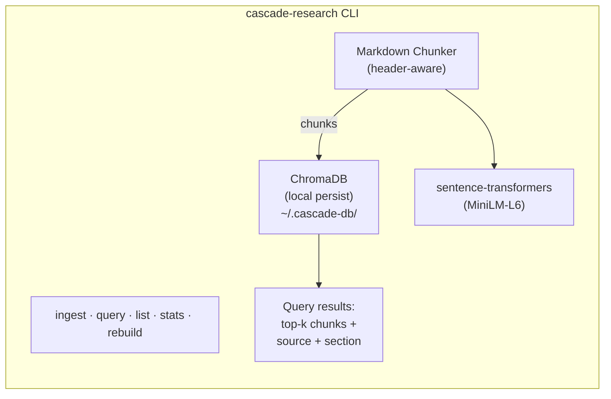

# Vector Database Implementation Plan

**Project:** Cascade — CLI semantic search over research files
**Date:** February 19, 2026
**Status:** Planning

---

## 1. Problem Statement

Cascade has accumulated ~82,000 tokens (~329KB) of research content across 52 markdown files in 4 directories. Every time a Claude Code agent or LangGraph agent needs to reference this research, it reads entire files into context — burning tokens and filling context windows.

**Current cost per full research load:** ~82K tokens (input) per conversation that touches research.

**Target:** A CLI tool that returns only the relevant 500–2,000 tokens per query via semantic search.

---

## 2. Project Scope — What We're Indexing

### File Inventory

| Directory | Files | Lines | Size | Content Type |
|-----------|-------|-------|------|-------------|
| `product-research/` | 10 | 3,568 | 173KB | Market analysis, ICP, growth loops, pivot analysis |
| `data/product-research/` | 6 | 1,319 | 68KB | Positioning research, competition, validation |
| `outputs/` | 4 | 1,996 | 93KB | Strategy synthesis, feature research, eval framework |
| `data/` (planning docs) | 13 | 2,149 | 61KB | Goals, quarterly plans, weekly plans, lean canvas |
| **Total** | **33 research-relevant** | **9,032** | **395KB** |

### Largest Files (Chunking Priority)

| File | Size | Lines | Notes |
|------|------|-------|-------|
| `outputs/cascade-full-strategy.md` | 40KB | 907 | Master synthesis — pulls from 17+ sources |
| `product-research/customer-flywheel.md` | 37KB | 640 | Journey maps, retention loops, ASCII diagrams |
| `product-research/growth-loops.md` | 30KB | 473 | 5 growth loop mechanics with stage detail |
| `product-research/market-opportunity.md` | 24KB | 457 | TAM/SAM/SOM, moat analysis, competitive landscape |
| `product-research/b2b-pivot-analysis.md` | 23KB | 357 | 7 B2B pivots ranked by feasibility |
| `outputs/eval-driven-development.md` | 23KB | 606 | Evaluation framework for product decisions |
| `outputs/feature-research.md` | 23KB | 319 | Feature prioritization research |

### Content Patterns

All research files follow consistent markdown structure:
- `#` / `##` / `###` header hierarchy
- Mix of prose paragraphs, bullet lists, numbered lists, tables
- Some ASCII flow diagrams (customer-flywheel, growth-loops)
- Code blocks in technical specs (reverse-cascade-langgraph)
- Blockquotes for emphasis

This structure is ideal for header-aware chunking.

---

## 3. Ecosystem Context

### Current Stack
- **Main project:** Node.js/TypeScript (no Python deps yet)
- **reverse-cascade:** LangGraph.js + Express + Anthropic SDK
- **NanoClaw:** WhatsApp agent (container-based, reads `data/`)
- **Claude Code:** Primary development interface

### Implication
Adding Python introduces a new dependency layer. The vector DB tool will be a standalone CLI — it doesn't need to integrate into the Node.js codebase. Agents call it via `bash` (e.g., `cascade-research query "pricing strategy"`).

---

## 4. Recommended Approach: ChromaDB + CLI

### Why ChromaDB

After evaluating 6 options (full comparison in Decision Summary below), **ChromaDB** is the recommendation:

1. **Fastest to working prototype.** Default embedding model (all-MiniLM-L6-v2) works out of the box. Five lines from install to first query.
2. **Full CRUD.** Add, update, delete individual documents by ID — critical for incremental re-indexing when you edit a research file.
3. **Best LangChain integration.** Official partner package. If you later wire this into LangGraph agents, the retriever interface is ready.
4. **Largest community.** ~25K GitHub stars, active development (Rust core rewrite in 2025 for 4x perf). Best docs, most tutorials, easiest to debug.

**Tradeoff acknowledged:** ChromaDB's dependency footprint is heavy (~200MB+). For a local CLI tool this is tolerable. If it becomes a problem, SQLite-vec is the lean fallback (see Decision Summary).

### Architecture



**Storage location:** `~/.cascade-research/` (outside project tree, avoids git noise)

---

## 5. Implementation Plan

### Step 1: Environment Setup

```bash
# Create the tool directory
mkdir -p tools/cascade-research

# Initialize Python project
cd tools/cascade-research
python3 -m venv .venv
source .venv/bin/activate

# Install dependencies
pip install chromadb               # Vector DB (~200MB with deps)
pip install langchain-text-splitters  # Markdown-aware chunking
pip install click                  # CLI framework
pip install rich                   # Pretty terminal output (optional)
```

**Dependencies (4 core):**
| Package | Purpose | Size |
|---------|---------|------|
| `chromadb` | Vector storage + default embeddings (includes sentence-transformers) | ~200MB |
| `langchain-text-splitters` | Markdown header splitter + recursive splitter | Light |
| `click` | CLI argument parsing | Light |
| `rich` | Formatted terminal output for query results | Light |

### Step 2: Embedding Model Selection

**Primary:** `all-MiniLM-L6-v2` (ChromaDB default)
- 384 dimensions, 256-token context, ~80MB model
- Downloads automatically on first use
- ~15ms per 1K tokens on CPU — fast enough for CLI

**Upgrade path if retrieval quality is poor:**
- `BAAI/bge-small-en-v1.5` — 384 dims, 512-token context, better accuracy
- `nomic-embed-text-v1.5` — 768 dims, 8K context, best quality but slower

Switching models requires a full re-index (`cascade-research rebuild`). Designing for this upfront.

### Step 3: Markdown Parsing & Chunking Strategy

**Two-stage pipeline:**

**Stage 1 — Header-aware split** (`MarkdownHeaderTextSplitter`)
- Split on `#`, `##`, `###` headers
- Each chunk inherits header hierarchy as metadata:
  ```
  {"h1": "Growth Loops", "h2": "Loop 3: Content Flywheel", "h3": "Stage 2: Distribution"}
  ```
- This preserves document structure in search results

**Stage 2 — Size enforcement** (`RecursiveCharacterTextSplitter`)
- Max chunk size: **800 characters** (~200 tokens)
- Overlap: **100 characters** (~25 tokens)
- Split on: `["\n\n", "\n", ". ", " "]` (paragraph → line → sentence → word)

**Why 800 chars?**
- Fits within MiniLM's 256-token context window
- Small enough that query results are precise, not bloated
- Large enough to preserve semantic meaning within a section
- For 395KB of markdown, expect **~400–600 chunks** — well within ChromaDB's comfort zone

**Special handling:**
- Tables: keep as single chunks (don't split mid-row)
- ASCII diagrams: keep as single chunks (don't split mid-diagram)
- Code blocks: keep as single chunks
- Bullet lists: split at list-item boundaries when possible

### Step 4: Metadata Tagging Strategy

Every chunk gets these metadata fields:

| Field | Example | Purpose |
|-------|---------|---------|
| `source_file` | `product-research/growth-loops.md` | Trace back to original file |
| `source_dir` | `product-research` | Filter by directory |
| `doc_type` | `research` / `planning` / `synthesis` / `template` | Filter by document category |
| `h1` | `Growth Loops` | Top-level section |
| `h2` | `Loop 3: Content Flywheel` | Sub-section |
| `h3` | `Stage 2: Distribution` | Sub-sub-section |
| `chunk_index` | `7` | Position within file (for ordering) |
| `file_modified` | `2026-02-19T14:30:00` | Detect stale chunks for incremental updates |

**Document type classification** (auto-detected from path):
- `product-research/` → `research`
- `data/product-research/` → `research`
- `outputs/` → `synthesis`
- `data/*.md` (goals, weekly plans) → `planning`
- `templates/` → `template`

### Step 5: Ingestion Pipeline

**Initial load:**
```
cascade-research ingest --all
```

1. Scan all configured directories for `.md` files
2. For each file:
   a. Read content
   b. Record file path + last-modified timestamp
   c. Run through two-stage chunking pipeline
   d. Tag each chunk with metadata
   e. Generate unique chunk IDs: `{file_hash}_{chunk_index}`
   f. Upsert into ChromaDB collection
3. Report: `Ingested 47 files → 523 chunks. Collection: cascade-research`

**Incremental update:**
```
cascade-research ingest                    # Re-index changed files only
cascade-research ingest path/to/file.md    # Re-index one specific file
```

1. For each `.md` file in scope:
   a. Compare `file_modified` timestamp to stored metadata
   b. If unchanged → skip
   c. If changed → delete all chunks with matching `source_file`, re-chunk, re-insert
   d. If file deleted from disk → delete all chunks with matching `source_file`
2. Report: `Updated 3 files (12 chunks replaced). 44 files unchanged.`

**Full rebuild:**
```
cascade-research rebuild
```

1. Delete the entire ChromaDB collection
2. Run full ingest from scratch
3. Useful after changing embedding model or chunk parameters

### Step 6: Query Interface

**Basic query:**
```bash
cascade-research query "What are the ICP pain points?"
```

Output:
```
Found 5 relevant chunks (showing top 3):

[1] product-research/pain-discovery.md → Pain Points
    Score: 0.87
    "Technical founders building solo or with tiny teams experience three
     core pain points: (1) planning paralysis — they know what to build
     but can't break it into sustainable weekly execution..."

[2] product-research/icp-research.md → Technical Founders → Pain Points
    Score: 0.82
    "The biggest friction isn't motivation — it's the gap between
     ambitious quarterly goals and daily task selection. They plan on
     Sunday, lose the thread by Wednesday..."

[3] outputs/cascade-full-strategy.md → Problem → Why Plans Fail
    Score: 0.79
    "Plans fail for three reasons: no feedback loop, no accountability
     structure, and no adaptation mechanism. The user sets a goal..."
```

**Query with filters:**
```bash
cascade-research query "pricing" --type research        # Only research docs
cascade-research query "Q1 targets" --dir data          # Only data directory
cascade-research query "retention" --top-k 10           # More results
cascade-research query "flywheel" --raw                 # Output as JSON (for agent consumption)
```

**Agent-optimized output** (`--raw` flag):
```json
{
  "query": "flywheel",
  "results": [
    {
      "text": "The customer flywheel has 5 stages...",
      "source": "product-research/customer-flywheel.md",
      "section": "Flywheel Architecture",
      "score": 0.91
    }
  ]
}
```

This is what Claude Code agents would parse — minimal tokens, structured, actionable.

**Utility commands:**
```bash
cascade-research list                   # Show all indexed files + chunk counts
cascade-research stats                  # Collection size, last indexed, top topics
```

### Step 7: Directory Configuration

Store ingestion config in the project so it travels with the repo:

**`tools/cascade-research/config.yaml`**
```yaml
# Directories to index (relative to project root)
directories:
  - path: product-research
    doc_type: research
  - path: data/product-research
    doc_type: research
  - path: outputs
    doc_type: synthesis
    exclude:
      - "cascade-pitch-deck/**"    # Skip binary output dirs
  - path: data
    doc_type: planning
    include:
      - "*.md"                     # Only markdown, not tracker.csv
    exclude:
      - "product-research/**"      # Already covered above

# Chunking parameters
chunking:
  max_chunk_size: 800
  chunk_overlap: 100
  headers_to_split_on:
    - ["#", "h1"]
    - ["##", "h2"]
    - ["###", "h3"]

# Embedding
embedding:
  model: all-MiniLM-L6-v2         # Change + rebuild to upgrade

# Storage
storage:
  path: ~/.cascade-research        # Outside project tree
  collection_name: cascade-research

# Query defaults
query:
  top_k: 5
  score_threshold: 0.5            # Minimum relevance score to return
```

### Step 8: Making It Callable from Anywhere

Add a shell alias or symlink so agents (and you) can call it from any directory:

```bash
# Option A: Shell alias (add to ~/.zshrc)
alias cascade-research="/Users/k2/Desktop/moltathon/cascade/tools/cascade-research/.venv/bin/python /Users/k2/Desktop/moltathon/cascade/tools/cascade-research/main.py"

# Option B: pip install in editable mode with entry_points (cleaner)
# In tools/cascade-research/pyproject.toml:
# [project.scripts]
# cascade-research = "cascade_research.cli:main"
```

Then from any Claude Code session:
```bash
cascade-research query "What's our TAM?"
```

### Step 9: Testing & Validation

**Smoke tests (manual):**
1. `cascade-research ingest --all` → verify chunk count is in 400–600 range
2. `cascade-research query "ICP"` → should return pain-discovery, icp-research chunks
3. `cascade-research query "pricing"` → should return pricing-strategy (even though it's a stub)
4. `cascade-research query "LangGraph implementation"` → should return reverse-cascade-langgraph chunks
5. `cascade-research query "something completely unrelated like pizza recipes"` → should return low-score or no results

**Quality validation:**
1. Pick 10 questions you'd actually ask about your research
2. Run each through `cascade-research query`
3. Check: do the top-3 results contain the answer? Is the source file correct?
4. If retrieval is poor on structured content (tables, lists), adjust chunk size
5. If retrieval misses cross-document themes, try increasing `top_k` to 8–10

**Incremental update test:**
1. Edit a file (add a line)
2. Run `cascade-research ingest`
3. Verify only that file was re-indexed (check output message)
4. Query for the new content → should appear

**Token savings estimate:**
- Before: ~82K tokens to load all research
- After: ~500–2,000 tokens per query (top-5 chunks × 200 tokens each)
- **Reduction: 40–160x fewer input tokens per research reference**

---

## 6. File Structure

```
tools/cascade-research/
├── pyproject.toml          # Package config + dependencies
├── config.yaml             # Directory + chunking + embedding config
├── cascade_research/
│   ├── __init__.py
│   ├── cli.py              # Click CLI entry point
│   ├── ingest.py           # Chunking pipeline + ChromaDB upsert
│   ├── query.py            # Search + result formatting
│   ├── chunker.py          # Markdown-aware two-stage chunker
│   ├── config.py           # YAML config loader
│   └── utils.py            # File hashing, timestamp comparison
└── tests/
    ├── test_chunker.py     # Verify chunking on sample markdown
    ├── test_ingest.py      # Verify ingestion + incremental updates
    └── test_query.py       # Verify retrieval quality
```

---

## 7. Future Enhancements (Not in Scope Now)

- **Watch mode:** `cascade-research watch` — auto-re-index on file save (fswatch + inotify)
- **LangGraph retriever node:** Wire ChromaDB as a tool node in the reverse-cascade graph
- **NanoClaw integration:** Let WhatsApp agent query research via the CLI
- **Multi-collection:** Separate collections for research vs. planning vs. templates
- **Hybrid search:** BM25 keyword search + vector semantic search for better precision
- **Embedding upgrade:** Switch to `nomic-embed-text-v1.5` if retrieval quality plateaus

---

## 8. Decision Summary

### Options Evaluated

#### ChromaDB ✅ CHOSEN
| | |
|---|---|
| **Pros** | Batteries-included (default embeddings work out of the box). Full CRUD — add/update/delete by ID. Best LangChain/LangGraph integration (official partner). Largest community (~25K stars). Automatic persistence. Well-documented. |
| **Cons** | Heavy dependency footprint (~200MB+ including onnxruntime, sentence-transformers). Python 3.13+ compatibility issues reported. Database migrations are irreversible between versions. Telemetry (posthog) included by default. |
| **Verdict** | Best fit. Fastest path to working tool. Dependency weight is the only real cost, and it's tolerable for a local CLI. |

#### SQLite-vec (Runner-up)
| | |
|---|---|
| **Pros** | Lightest dependency footprint (near-zero). Single `.sqlite` file. Full SQL CRUD, ACID-compliant. No bloat. Elegant simplicity. |
| **Cons** | No built-in embeddings — need separate sentence-transformers install. LangChain integration is basic (~50–100 lines of glue code). Solo maintainer project (~4K stars). Brute-force KNN (fine at this scale, won't scale past ~100K vectors). |
| **Verdict** | Best "lean" option. Choose this if dependency minimalism matters more than setup speed. Would require ~2x the glue code of ChromaDB. |

#### Qdrant Local Mode (Honorable Mention)
| | |
|---|---|
| **Pros** | Clean API. FastEmbed uses ONNX (avoids PyTorch bloat). Built-in BM25 for hybrid search. Official LangChain partner. |
| **Cons** | Local Python mode is not Qdrant's primary focus (Rust server + cloud is). Local mode is a Python reimplementation, not the Rust engine. FastEmbed is a separate install. |
| **Verdict** | Good middle ground between ChromaDB's weight and SQLite-vec's minimalism. FastEmbed's ONNX approach is appealing. Worth revisiting if ChromaDB's deps become painful. |

#### LanceDB (Skip for Now)
| | |
|---|---|
| **Pros** | Rust-backed, efficient columnar storage (Apache Arrow). Good for large-scale multimodal data. Used by Midjourney in production. |
| **Cons** | Pre-1.0 API (may change). SQL-style update expressions add unnecessary complexity. Over-engineered for ~400KB of markdown. Smaller community for simple RAG use cases. |
| **Verdict** | Technically impressive but wrong tool for this scale. Revisit if data grows 100x. |

#### FAISS (Skip)
| | |
|---|---|
| **Pros** | Raw vector search speed. Extremely well-tested (Meta). Compact storage. |
| **Cons** | Not a database — no metadata, no persistence, no CRUD. Deleting/updating vectors is painful. Manual save/load. Pickle serialization. Needs wrapper for everything. |
| **Verdict** | Solves a problem (billion-scale search) you don't have. The incremental update story is a dealbreaker for regularly-edited markdown files. |

#### Other Options Considered
| Option | Status | Why Skipped |
|--------|--------|-------------|
| **txtai** | All-in-one FAISS + sentence-transformers + SQLite | Heavier than ChromaDB with less community. Opinionated in ways that may conflict with your setup. |
| **DuckDB + vss** | Vector search extension for DuckDB | Extension is early-stage. Not well-integrated yet. DuckDB itself is great but VSS is not its strength. |
| **ObjectBox** | On-device DB with vector search | Mobile/IoT focus. Python is secondary ecosystem. Wrong tool. |

### Final Decision

**ChromaDB** for the initial implementation. The dependency weight (~200MB) is the known tradeoff — accepted because:
1. It eliminates all glue code for embeddings, persistence, and CRUD
2. The LangChain retriever interface is ready if you wire it into LangGraph later
3. At this project stage, development speed matters more than install size
4. If deps become a problem, migrating to SQLite-vec is straightforward (same chunks, same metadata, different storage backend)

### Embedding Model

**all-MiniLM-L6-v2** (ChromaDB default). Upgrade to `BAAI/bge-small-en-v1.5` if retrieval quality is insufficient. Both are local, free, and fast on CPU.

### What You'd Gain by Switching Later

| Switch To | You'd Gain | You'd Lose |
|-----------|-----------|-----------|
| SQLite-vec | ~180MB smaller install, single-file DB, zero bloat | Built-in embeddings, polished LangChain integration |
| Qdrant + FastEmbed | Hybrid search (BM25 + vector), lighter than ChromaDB | Simplicity — two packages instead of one |
| Hosted solution (Pinecone, Weaviate Cloud) | Shared access across devices, no local compute | Zero-cost guarantee, offline capability, data sovereignty |

---

## Sources

- [ChromaDB Docs](https://docs.trychroma.com/) — v1.5.0, Feb 2026
- [ChromaDB GitHub](https://github.com/chroma-core/chroma) — ~25K stars
- [LanceDB Docs](https://lancedb.com/docs/) — v0.29.2
- [Qdrant Python Client](https://python-client.qdrant.tech/) — v1.13.3
- [sqlite-vec GitHub](https://github.com/asg017/sqlite-vec) — v0.1.6
- [FAISS GitHub](https://github.com/facebookresearch/faiss) — v1.9.0
- [LangChain MarkdownHeaderTextSplitter](https://python.langchain.com/docs/how_to/markdown_header_metadata_splitter/)
- [Best Open-Source Embedding Models 2026](https://www.bentoml.com/blog/a-guide-to-open-source-embedding-models)
- [Chroma vs Qdrant Comparison](https://airbyte.com/data-engineering-resources/chroma-db-vs-qdrant)
